# PicTalkie

**Off-Grid Image Transmission via Audio**

PicTalkie lets you send a photo using ONLY a walkie-talkie radio. No internet, no cell towers, no Wi-Fi -- just two radios and sound waves. Designed for emergencies where all other communication is down.

A first responder can photograph their location, transmit it as audio over a walkie-talkie, and someone miles away can decode the audio back into the original image -- all in under 15 seconds.

*Pittsburgh Regional Science & Engineering Fair Project*

## Quickstart

```bash
# 1. Clone and install dependencies
git clone <repo-url> && cd PicTalkie
uv sync

# 2. Launch the GUI
uv run python main.py
```

This opens PicTalkie's home screen. Click **Encoder** to convert an image to audio, or **Decoder** to reconstruct an image from a WAV file.

## Programmatic Example

You can use PicTalkie as a library without the GUI:

```python
from pictalkie.image import load_and_process_image, extract_pixels_hilbert
from pictalkie.audio import encode_to_samples, save_wav, decode_wav_file

# --- Encode an image to a WAV file ---
img = load_and_process_image("photo.jpg")        # Pad + resize to 128x128
pixel_values = extract_pixels_hilbert(img)        # Extract pixels in Hilbert order
samples = encode_to_samples(pixel_values)         # Convert to Baird-encoded audio
save_wav(samples, "photo.wav")                    # Save as 16-bit PCM WAV (~14.5s)

# --- Decode a WAV file back to an image ---
reconstructed = decode_wav_file("photo.wav")      # Full pipeline: WAV -> PIL Image
reconstructed.save("photo_decoded.png")           # Save as PNG
```

You can also use individual components:

```python
from pictalkie.baird import baird_amplitude, inverse_baird

amp = baird_amplitude(200)      # 0.486 -- pixel brightness to audio amplitude
val = inverse_baird(amp)        # 200   -- back to pixel value (lossless round-trip)

from pictalkie.hilbert import get_hilbert_order

order = get_hilbert_order(128)  # [(x, y), ...] -- 16,384 coordinates in curve order
```

## How It Works

```mermaid
graph TD
    subgraph Encoder["ENCODER (Image -> Audio)"]
        direction TB
        E1["Load image (PNG, JPG, BMP, ...)"] --> E2["Convert to RGB"]
        E2 --> E3["Pad to square with black bars\n(no cropping -- preserves full image)"]
        E3 --> E4["Resize to 128x128\n(Lanczos resampling)"]
        E4 --> E5["Extract R, G, B values\nin Hilbert curve order\n(16,384 pixels x 3 = 49,152 values)"]
        E5 --> E6["Apply Baird formula to each value\namp = (value - 127) / 255 + 0.2\n(maps 0-255 to -0.3 ... +0.7)"]
        E6 --> E7["Repeat each amplitude 13x\n(49,152 x 13 = 638,976 samples)"]
        E7 --> E8["Write 16-bit PCM WAV\n44,100 Hz mono | 14.49 seconds"]
    end

    subgraph Transmission["RADIO TRANSMISSION"]
        direction TB
        TX["Play WAV into walkie-talkie"] --> RX["Record audio on receiving end"]
    end

    subgraph Decoder["DECODER (Audio -> Image)"]
        direction TB
        D1["Load WAV file\n(supports 8/16/24/32-bit, stereo)"] --> D2["Normalize samples to -1.0 ... +1.0\n(extract first channel if stereo)"]
        D2 --> D3["Chunk into groups of 13 samples"]
        D3 --> D4["Average each group\n(cancels noise, recovers amplitude)\nSNR improvement = sqrt 13 ~ 3.6x"]
        D4 --> D5["Apply inverse Baird formula\nvalue = (amp - 0.2) x 255 + 127\n(maps amplitude back to 0-255)"]
        D5 --> D6["Clamp to 0-255 integer range"]
        D6 --> D7["Place pixels on 128x128 grid\nvia inverse Hilbert curve mapping"]
        D7 --> D8["Reconstruct RGB image\n128x128 pixels | 16.7M colors"]
    end

    E8 --> TX
    RX --> D1

    style Encoder fill:#1a1a2e,stroke:#ff6b35,color:#e6edf3
    style Transmission fill:#0d1117,stroke:#8b949e,color:#e6edf3
    style Decoder fill:#1a1a2e,stroke:#3fb950,color:#e6edf3
```



## Key Specs

| Parameter        | Value                  |
|-----------------|------------------------|
| Resolution      | 128 x 128 pixels       |
| Color           | Full RGB (16.7M colors)|
| Audio duration  | 14.49 seconds          |
| Sample rate     | 44,100 Hz (CD quality) |
| Noise resilience| 13x averaging (~3.6x SNR improvement) |
| Accuracy        | 100% on clean round-trip|
| Format          | Standard 16-bit PCM WAV|

## Installation

### Requirements

- Python 3.12+
- [uv](https://docs.astral.sh/uv/) (recommended) or pip

### Using uv (recommended)

```bash
uv sync                  # Install all dependencies from pyproject.toml
uv run python main.py    # Launch the app
```

### Using pip

```bash
pip install pygame-ce pygame-gui numpy pillow
python main.py
```

## Project Structure

```
PicTalkie/
  main.py                    # Entry point
  pictalkie/                 # Modular package
    __init__.py
    constants.py             # Encoding params, colors, window settings
    baird.py                 # Baird amplitude formula (pixel <-> audio)
    hilbert.py               # Hilbert space-filling curve
    image.py                 # Image load/pad/resize and reconstruction
    audio.py                 # WAV I/O, encoding, decoding pipelines
    app.py                   # Main loop, pygame_gui manager, screen dispatch
    theme.json               # Dark UI theme for pygame_gui
    ui/
      __init__.py
      components.py          # Waveform drawing, audio playback helpers
      home.py                # Home screen (navigation)
      encoder.py             # Encoder screen (image -> audio)
      decoder.py             # Decoder screen (audio -> image, live animation)
```

## Architecture

### Core Algorithms

**Baird Amplitude Formula** -- Converts pixel brightness (0-255) to audio amplitude (-1 to +1). Based on John Logie Baird's 1920s mechanical television system. The 0.2 DC offset ensures mid-gray is distinguishable from silence.

```
Forward:  amplitude = (value - 127) / 255 + 0.2
Inverse:  value = (amplitude - 0.2) * 255 + 127
```

**Hilbert Curve** -- A space-filling curve that visits every pixel while preserving spatial locality. If radio static corrupts a section of audio, damage appears as a small blob instead of a long streak. Grid size must be a power of 2.

**Flat Block Encoding** -- Each pixel value is written as 13 identical audio samples. The decoder averages each group of 13, which cancels random noise via the law of large numbers (SNR improvement = sqrt(13) ~ 3.6x).

### Design Decisions

- **Padding over cropping**: Black bars preserve the complete image -- critical in emergencies where every detail matters.
- **128x128 resolution**: Largest power-of-2 size that fits in 15 seconds. (64x64 is too small; 256x256 would take ~57s.)
- **13 samples per value**: Maximum repetition that keeps audio under 15 seconds while maximizing noise resilience.

### Module Responsibilities

| Module | Purpose |
|--------|---------|
| `baird.py` | Forward and inverse Baird formula (2 functions) |
| `hilbert.py` | Hilbert curve index-to-coordinate conversion |
| `image.py` | Load/pad/resize images, extract/reconstruct pixels in Hilbert order |
| `audio.py` | WAV read/write, encode pixel values to samples, decode samples to pixels |
| `constants.py` | All tunable parameters and colors in one place |
| `app.py` | Pygame + pygame_gui init, screen dispatch loop, temp file cleanup |
| `theme.json` | Dark UI theme (colors, fonts) for pygame_gui |
| `ui/components.py` | Waveform drawing, audio playback helpers, PIL conversion |
| `ui/home.py` | Home screen with navigation buttons |
| `ui/encoder.py` | Image selection, preview, encoding, waveform display, audio playback |
| `ui/decoder.py` | WAV selection, live pixel-by-pixel decoding animation synced to audio |

## Usage

### Encoder
1. Launch PicTalkie and click **Encoder**
2. Click **Select Image** and choose any image file
3. Preview shows the original alongside the processed 128x128 version
4. Click **ENCODE TO AUDIO** to generate the audio
5. **Play** to preview or **Save WAV** to export

### Decoder
1. Click **Decoder** from the home screen
2. Click **Select WAV File** and choose a PicTalkie-encoded WAV
3. Click **DECODE TO IMAGE** to watch the live reconstruction
4. The image builds pixel-by-pixel in sync with audio playback
5. Click **Save Image as PNG** when complete

## License

This project was created for the Pittsburgh Regional Science & Engineering Fair.
