# PicTalkie

**Off-Grid Image Transmission via Audio**

PicTalkie lets you send a photo using ONLY a walkie-talkie radio. No internet, no cell towers, no Wi-Fi -- just two radios and sound waves. Designed for emergencies where all other communication is down.

A first responder can photograph their location, transmit it as audio over a walkie-talkie, and someone miles away can decode the audio back into the original image -- all in about 58 seconds.

*Pittsburgh Regional Science & Engineering Fair Project*

## Quickstart

```bash
# 1. Clone and install dependencies
git clone <repo-url> && cd PicTalkie
uv sync

# 2. Launch the GUI
uv run python main.py
```

This opens PicTalkie's home screen. Click **Encoder** to convert an image to audio, or **Decoder** to reconstruct an image from a WAV file.

## Programmatic Example

You can use PicTalkie as a library without the GUI:

```python
from pictalkie.image import load_and_process_image, extract_pixels_hilbert
from pictalkie.audio import encode_to_samples, save_wav, decode_wav_file

# --- Encode an image to a WAV file ---
img = load_and_process_image("photo.jpg")        # Pad + resize to 256x256
pixel_values = extract_pixels_hilbert(img)        # Extract pixels in Hilbert order
samples = encode_to_samples(pixel_values)         # Convert to Baird-encoded audio
save_wav(samples, "photo.wav")                    # Save as 16-bit PCM WAV (~58s)

# --- Decode a WAV file back to an image ---
reconstructed = decode_wav_file("photo.wav")      # Full pipeline: WAV -> PIL Image
reconstructed.save("photo_decoded.png")           # Save as PNG
```

You can also use individual components:

```python
from pictalkie.baird import baird_amplitude, inverse_baird

amp = baird_amplitude(200)      # 0.486 -- pixel brightness to audio amplitude
val = inverse_baird(amp)        # 200   -- back to pixel value (lossless round-trip)

from pictalkie.hilbert import get_hilbert_order

order = get_hilbert_order(256)  # [(x, y), ...] -- 65,536 coordinates in curve order
```

## How It Works

```mermaid
graph TD
    subgraph Encoder["ENCODER (Image -> Audio)"]
        direction TB
        E1["Load image (PNG, JPG, BMP, ...)"] --> E2["Convert to RGB"]
        E2 --> E3["Pad to square with black bars\n(no cropping -- preserves full image)"]
        E3 --> E4["Resize to 256x256\n(Lanczos resampling)"]
        E4 --> E5["Extract R, G, B values\nin Hilbert curve order\n(65,536 pixels x 3 = 196,608 values)"]
        E5 --> E6["Build protocol message:\nPreamble | Calibration | Sync | Header | Pixel Data"]
        E6 --> E7["Apply Baird formula to each value\namp = (value - 127) / 255 + 0.2\n(maps 0-255 to -0.3 ... +0.7)"]
        E7 --> E8["Repeat each amplitude 13x\n(196,608 x 13 = 2,555,904 data samples)"]
        E8 --> E9["Write 16-bit PCM WAV\n44,100 Hz mono | 61.17 seconds"]
    end

    subgraph Transmission["RADIO TRANSMISSION"]
        direction TB
        TX["Play WAV into walkie-talkie"] --> RX["Record audio on receiving end"]
    end

    subgraph Decoder["DECODER (Audio -> Image)"]
        direction TB
        D1["Load WAV file\n(supports 8/16/24/32-bit, stereo)"] --> D2["Normalize samples to -1.0 ... +1.0\n(extract first channel if stereo)"]
        D2 --> D3["Parse protocol:\nSkip preamble, read calibration,\nverify sync, read header"]
        D3 --> D4["Build correction table\nfrom 256 calibration levels"]
        D4 --> D5["Chunk pixel data into groups of 13"]
        D5 --> D6["Average each group\n(cancels noise, recovers amplitude)\nSNR improvement = sqrt 13 ~ 3.6x"]
        D6 --> D7["Map amplitude to pixel value\nvia calibration correction table"]
        D7 --> D8["Place pixels on grid\nusing dimensions from header\nvia inverse Hilbert curve mapping"]
        D8 --> D9["Reconstruct RGB image\n256x256 pixels | 16.7M colors"]
    end

    E9 --> TX
    RX --> D1

    style Encoder fill:#1a1a2e,stroke:#ff6b35,color:#e6edf3
    style Transmission fill:#0d1117,stroke:#8b949e,color:#e6edf3
    style Decoder fill:#1a1a2e,stroke:#3fb950,color:#e6edf3
```



## Audio Message Structure

PicTalkie wraps the pixel data in a self-describing protocol so the decoder can survive real-world radio conditions. The full message looks like this:

```
|<-------------------------------- 2,697,465 samples (61.17 seconds) -------------------------------->|
|                                                                                                      |
| Preamble | Gap | Calibration | Gap | Sync  | Gap | Header | Gap |         Pixel Data                |
| 0.30s    |50ms | 2.56s       |50ms | 0.12s |50ms | 0.03s  |50ms |         57.96s                    |
```

### 1. Preamble (0.3s -- 13,230 samples)

A steady carrier tone at the baseline amplitude (0.2). Gives the walkie-talkie time to "wake up" -- radios have a slight delay before audio passes through, so this ensures the decoder doesn't miss the start. Also lets the decoder lock onto the signal level.

### 2. Calibration (2.56s -- 112,896 samples)

Sends all 256 possible amplitude levels (pixel values 0-255) in order, each held for 441 samples (~10ms). The radio channel distorts amplitudes through volume changes, compression, and noise. The decoder measures what each level actually sounds like after transmission and builds a correction lookup table. Without this, dark grays and light grays would be indistinguishable after radio distortion.

```
| Level 0 (441 samples) | Level 1 (441 samples) | ... | Level 255 (441 samples) |
| amp = -0.298          | amp = -0.294          | ... | amp = +0.702            |
```

### 3. Sync (0.12s -- 5,292 samples)

An alternating low-high-low-high pattern (`0, 255, 0, 255, 0, 255`) that's easy to detect, each held for 882 samples. Tells the decoder "the header and image data start right after this." Without it, the decoder wouldn't know exactly where calibration ends and data begins, especially if radio timing drifts.

### 4. Header (0.03s -- 1,323 samples)

Three Baird-encoded values at 441 samples each: **width** (256), **height** (256), **channels** (3). The decoder reads these to know the image dimensions without hardcoding them -- both sides don't need to share any configuration.

### 5. Gaps (50ms -- 2,205 samples each)

Brief silences (amplitude 0.0) between each section so they don't bleed into each other. Four gaps total: after preamble, after calibration, after sync, and after header.

### 6. Pixel Data (57.96s -- 2,555,904 samples)

The image itself. Each of the 196,608 pixel values (65,536 pixels x 3 RGB channels) is Baird-encoded and repeated 13 times for noise resilience. Pixels are ordered along a Hilbert curve, not row-by-row.

```
| Pixel 1 R  | Pixel 1 G  | Pixel 1 B  | Pixel 2 R  | ...  | Pixel 65536 B  |
| 13 samples | 13 samples | 13 samples | 13 samples | ...  | 13 samples     |
```

### Protocol overhead

| Section     | Duration | Samples  | Purpose |
|-------------|----------|----------|---------|
| Preamble    | 0.30s    | 13,230   | Radio wake-up, carrier lock |
| Gap         | 0.05s    | 2,205    | Section separator |
| Calibration | 2.56s    | 112,896  | Amplitude correction table |
| Gap         | 0.05s    | 2,205    | Section separator |
| Sync        | 0.12s    | 5,292    | Alignment marker |
| Gap         | 0.05s    | 2,205    | Section separator |
| Header      | 0.03s    | 1,323    | Image dimensions |
| Gap         | 0.05s    | 2,205    | Section separator |
| Pixel data  | 57.96s   | 2,555,904| The image |
| **Total**   | **61.17s** | **2,697,465** | |

The protocol adds ~3.2 seconds of overhead to the ~58-second image transmission -- a small cost for reliable decoding over noisy radio channels.

## Key Specs

| Parameter        | Value                  |
|-----------------|------------------------|
| Resolution      | 256 x 256 pixels       |
| Color           | Full RGB (16.7M colors)|
| Audio duration  | 61.17 seconds          |
| Sample rate     | 44,100 Hz (CD quality) |
| Noise resilience| 13x averaging (~3.6x SNR improvement) |
| Calibration     | 256-level correction table from transmission |
| Accuracy        | 100% on clean round-trip|
| Format          | Standard 16-bit PCM WAV|

## Installation

### Requirements

- Python 3.12+
- [uv](https://docs.astral.sh/uv/) (recommended) or pip

### Using uv (recommended)

```bash
uv sync                  # Install all dependencies from pyproject.toml
uv run python main.py    # Launch the app
```

### Using pip

```bash
pip install pygame-ce pygame-gui numpy pillow
python main.py
```

## Project Structure

```
PicTalkie/
  main.py                    # Entry point
  pictalkie/                 # Modular package
    __init__.py
    constants.py             # Encoding params, colors, window settings
    baird.py                 # Baird amplitude formula (pixel <-> audio)
    hilbert.py               # Hilbert space-filling curve
    image.py                 # Image load/pad/resize and reconstruction
    audio.py                 # WAV I/O, encoding, decoding pipelines
    app.py                   # Main loop, pygame_gui manager, screen dispatch
    theme.json               # Dark UI theme for pygame_gui
    ui/
      __init__.py
      components.py          # Waveform drawing, audio playback helpers
      home.py                # Home screen (navigation)
      encoder.py             # Encoder screen (image -> audio)
      decoder.py             # Decoder screen (audio -> image, live animation)
```

## Algorithms Explained

PicTalkie uses three core algorithms working together. Here's what each one does and why it matters.

### 1. Baird Amplitude Formula

*What it does:* Converts a pixel's brightness into a sound level.

Think of it like a dimmer switch -- a dark pixel becomes a quiet sound, a bright pixel becomes a loud sound. This is the same principle John Logie Baird used in the 1920s to build the first working television, where audio signals controlled the brightness of a lamp.

```
Encoding:  amplitude = (pixel_value - 127) / 255 + 0.2
Decoding:  pixel_value = (amplitude - 0.2) * 255 + 127
```

**Why the +0.2 offset?** Without it, a mid-gray pixel (value 127) would map to silence (amplitude 0). The decoder wouldn't be able to tell the difference between "gray pixel" and "no signal." The offset shifts everything up so every pixel produces a distinct sound level.

| Pixel | Color | Amplitude | Sound |
|-------|-------|-----------|-------|
| 0 | Black | -0.30 | Quiet, inverted |
| 76 | Dark gray | 0.00 | Silence point |
| 127 | Mid-gray | +0.20 | Baseline hum |
| 200 | Light | +0.49 | Moderately loud |
| 255 | White | +0.70 | Loudest |

### 2. Hilbert Space-Filling Curve

*What it does:* Decides the order in which pixels are read from the image.

Instead of reading pixels left-to-right like reading a book, PicTalkie follows a Hilbert curve -- a single path that snakes through the entire image while keeping nearby pixels close together in the sequence.

```
Hilbert order:          Row-by-row order:
0---1   14--15          0  1  2  3
    |   |               4  5  6  7
3---2   13--12          8  9  10 11
|            |          12 13 14 15
4   7---8   11
|   |   |    |
5---6   9--10
```

**Why does this matter?** If radio static corrupts a chunk of audio, it damages a consecutive sequence of pixel values. With row-by-row order, that corruption would appear as a long horizontal streak across the image. With the Hilbert curve, the same corruption appears as a small localized blob -- much less destructive to the overall image.

### 3. Flat Block Repetition (Noise Resilience)

*What it does:* Each pixel value is written as 13 identical audio samples instead of just 1.

This is PicTalkie's defense against walkie-talkie noise. When the decoder receives the audio, it groups every 13 samples and takes their average. Random noise pushes some samples up and others down, but the average cancels it out.

```
Encoder writes:  [0.49, 0.49, 0.49, 0.49, 0.49, 0.49, 0.49, 0.49, 0.49, 0.49, 0.49, 0.49, 0.49]
                  \_________________________ 13 identical copies _________________________/

After radio noise: [0.51, 0.47, 0.52, 0.48, 0.50, 0.46, 0.53, 0.49, 0.48, 0.51, 0.47, 0.50, 0.49]
                    \_________________________ noise added to each _________________________/

Decoder averages:  0.493  (close to the original 0.49 -- noise cancelled out!)
```

The noise reduction follows the statistical law of large numbers: **SNR improvement = sqrt(N)**. With 13 repetitions, noise is reduced by a factor of ~3.6x.

### Design Decisions

- **Padding over cropping**: Images are padded with black bars to make them square, never cropped. In an emergency, every part of the image could matter -- a street sign at the edge, a building number in the corner.
- **256x256 resolution**: The Hilbert curve requires a power-of-2 grid size. 256x256 gives 65,536 pixels of detail at the cost of ~58 seconds of audio. The previous 128x128 mode fit in 15 seconds but had 4x fewer pixels.
- **13 samples per value**: Chosen to maximize noise resilience for analog radio transmission. Lower values (e.g., 3 or 5) would shorten the audio but reduce tolerance for walkie-talkie static.

### Module Responsibilities

| Module | Purpose |
|--------|---------|
| `baird.py` | Forward and inverse Baird formula (2 functions) |
| `hilbert.py` | Hilbert curve index-to-coordinate conversion |
| `image.py` | Load/pad/resize images, extract/reconstruct pixels in Hilbert order |
| `audio.py` | WAV read/write, encode pixel values to samples, decode samples to pixels |
| `constants.py` | All tunable parameters and colors in one place |
| `app.py` | Pygame + pygame_gui init, screen dispatch loop, temp file cleanup |
| `theme.json` | Dark UI theme (colors, fonts) for pygame_gui |
| `ui/components.py` | Waveform drawing, audio playback, microphone recording, PIL conversion |
| `ui/home.py` | Home screen with navigation buttons |
| `ui/encoder.py` | Image selection, preview, encoding, waveform display, audio playback |
| `ui/decoder.py` | WAV or microphone input, live pixel-by-pixel decoding animation |

## Usage

### Encoder
1. Launch PicTalkie and click **Encoder**
2. Click **Select Image** and choose any image file
3. Preview shows the original alongside the processed 256x256 version
4. Click **ENCODE TO AUDIO** to generate the audio
5. **Play** to preview or **Save WAV** to export

### Decoder
1. Click **Decoder** from the home screen
2. Load audio in one of two ways:
   - **Select WAV File** -- choose a previously saved PicTalkie WAV
   - **Record from Mic** -- record live audio from your microphone (click again to stop)
3. Click **DECODE TO IMAGE** to watch the live reconstruction
4. The image builds pixel-by-pixel in sync with audio playback
5. Click **Save Image as PNG** when complete

## License

This project was created for the Pittsburgh Regional Science & Engineering Fair.
