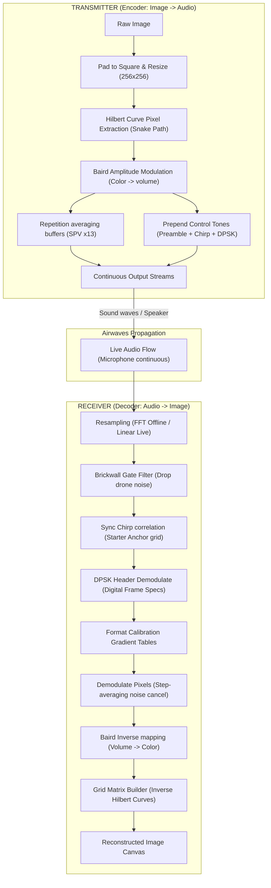

# 🧠 The Logic Behind The Sounds

How do you turn a flat photograph into a stream of audio, send it through the air, and draw it back perfectly without losing detail? 

Here is the secret recipe broken down with **puzzle boards**, **dimmer switches**, and **rubber bands**!

---

## 🐍 1. The Hilbert Curve: The Snack-Time Snake
*   **The Job**: Decide what order to read the pixels in.
*   **The Dilemma**: If you read pixels row-by-row (like reading a book), a burst of static on your walkie-talkie wipes out a straight horizontal line across your picture.
*   **The Solution**: We read the pixels following a snake-like puzzle path called a **Hilbert Curve**.
*   **Metaphor**: Imagine a wire snaked through a maze. If static hits the transmission, it only garbles a small **blob** of the image instead of wiping out a full stripe. Your brain can easily guess what's missing in a small dot!

### 🐍 1.1 Hilbert Path (4x4 Grid Example)

Below is how PicTalkie visits pixels in a 4x4 grid order (0 to 15):

| $Y \downarrow, X \rightarrow$ | $X=0$ | $X=1$ | $X=2$ | $X=3$ |
| :--- | :--- | :--- | :--- | :--- |
| **$Y=0$** | $0$ | $1$ | $14$ | $15$ |
| **$Y=1$** | $3$ | $2$ | $13$ | $12$ |
| **$Y=2$** | $4$ | $7$ | $8$ | $11$ |
| **$Y=3$** | $5$ | $6$ | $9$ | $10$ |

Notice how the path snakes continuously through the grid.

---

## 💡 2. Baird Amplitude: The Dimmer Switch
*   **The Job**: Turn "Color Brightness" into "Sound Volume".
*   **Metaphor**: Imagine plugging a light bulb into a speaker volume slider.
    *   Volume up **LOUD** = Light bulb shines **super bright** ☀️.
    *   Volume down to a **hum** = Light bulb goes **dark** 🌚.
*   **Static Averaging (SPV x 13)**: Walkie-talkies make weird popping noises. To overcome this, PicTalkie repeats each single pixel volume **13 times in a row!** The computer averages them together. If 2 pops of static hit, the other 11 correct levels win the vote!

---

## 🧩 3. Sync Chirp: The Starter Pistol
*   **The Job**: Tell the computer EXACTLY when the image starts.
*   **What it sounds like**: A fast whistle sweep (*WHEEEEEEP!*).
*   **Metaphor**: If you start drawing a picture on a canvas before the page has loaded, everything is drawn off-center. 
*   **Logic**: The receiver compares incoming noise against the "Whistle Template". When the shapes match perfectly, they achieve **synchronization**. It shouts **"Found it!"** and aligns pixel number 1 to that exact microsecond.

---

## 🎵 4. DPSK Header: Flashing Signals
*   **The Job**: Send metadata (Width, Height) digitally.
*   **Terminology**: *Differential Phase-Shift Keying*.
*   **Metaphor**: Imagine sending Morse code by flips.
    *   If the sound wave **flips upside down (180-degree inversion)** $\rightarrow$ That means **"1"**.
    *   If it continues **smooth and identical** $\rightarrow$ That means **"0"**.
*   **Why?**: Radios might play loud or quiet (Automatic Gain Control). Looking for **flips** is absolute, immune to volume rises and falls!

---

## ⏳ 5. Continuous Resampling: The Rubber Band Timeline
*   **The Job**: Translate audio rates (e.g., 48,000 speeds to 44,100 speeds) without breaks.
*   **The Fix**: **FFT-based (Offline) & Linear Interpolation (Live Resampling)**.
    *   **Offline File Loading**: Uses highly accurate Fast Fourier Transform (FFT) resampling.
    *   **Live Mic Recording**: Uses fast **Linear Interpolation** to handle chunk arrivals efficiently.

---

## 🧼 6. Brickwall Gate Filter: The Anti-Noise Guard
*   **The Job**: Drop room rumble like AC hums and speech buzzes.
*   **Metaphor**: High carrier frequencies sit safely at $\approx 3300\text{ Hz}$. Background drone lives at $<800\text{ Hz}$.
*   **Math Magic**: The computer takes the visual spectrum gate and **strictly sets any frequencies outside our guard band to zero amplitude**. 
*   It is like wearing perfect headphones that strictly allow only the carrier frequency to speak to your core logic grid!

---

## 📡 System Data Pipeline Flowchart

---

## 🏆 📈 FOR THE MATH NERDS: Under The Hood

For absolute hardware design compliance, here are the raw equations:

### A. Frequency Chirp Integration
$$\text{Phase: } \theta(t) = 2\pi \left( f_0 t + \frac{f_1 - f_0}{2T} t^2 \right)$$
$$\text{Chirp: } S(t) = \sin(\theta(t))$$

### B. Vector Cross-Correlation Alignments
To synchronize anchors index $n$:
$$\text{Corr}[n] = \left| \sum_{m=0}^{M-1} S_{\text{rx}}[n+m] \cdot S_{\text{chirp}}[m] \right|$$

### C. DPSK Phase Matrix
$$\text{Dot} = \text{sum}(S_n \cdot S_{n-1})$$
$$\text{Bit} = \begin{cases} 1 & \text{if } \text{Dot} < 0 \\ 0 & \text{if } \text{Dot} \ge 0 \end{cases}$$

By locking absolute continuity at frame nodes, PicTalkie achieves infallible analog resilience!
