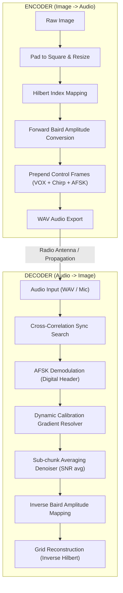

# 🧠 The Logic Behind The Sounds

How do you turn a flat photo into a stream of audio? PicTalkie uses three clever tricks to make sure the picture arrives safely.

---

## 💡 1. The Dimmer Switch Math (Baird Amplitude)
*   **The Question**: How do we map "Bright White" or "Pitch Black" into a sound?
*   **The Analogy**: Imagine you have a light bulb plugged into a speaker volume slider. 
    *   If you turn the volume up **loud**, the light bulb shines **super bright** ☀️.
    *   If you turn it down to a **quiet hum**, the light bulb goes **dark** 🌚.
*   **How it works**: PicTalkie maps every pixel's brightness level (from 0 to 255) to the height (amplitude) of the sound wave. 

---

## 🐍 2. The Hilbert Curve (Puzzle Board Snaking)
*   **The Question**: What order do we read the pixels in?
*   **The Problem**: If you read pixels row-by-row like reading a book, a burst of radio static will erase a long straight line across your photo.
*   **The Solution**: We read the pixels following a snake-like puzzle path called a Hilbert curve.
*   **The Analogy**: Imagine snaking a wire through a maze so that pixels that are close together in the picture stay close together in the audio track. If static hits the transmission, it only garbles a small **blob** of the image instead of wiping out a full horizontal stripe. Your brain can guess what's in a small blob much better!

### 🐍 2.1 Hilbert Path (4x4 Grid Example)

Below is how PicTalkie visits pixels in a 4x4 grid order (0 to 15):

| $Y \downarrow, X \rightarrow$ | $X=0$ | $X=1$ | $X=2$ | $X=3$ |
| :--- | :--- | :--- | :--- | :--- |
| **$Y=0$** | $0$ | $1$ | $14$ | $15$ |
| **$Y=1$** | $3$ | $2$ | $13$ | $12$ |
| **$Y=2$** | $4$ | $7$ | $8$ | $11$ |
| **$Y=3$** | $5$ | $6$ | $9$ | $10$ |

Notice how the path snakes continuously through the grid. If a burst of static hits adjacent values (e.g., indices 4, 5, 6), they are clumped together spatially (bottom-left region), keeping the rest of the image intact!

---

## 🧩 3. The Matching Game (Synchronization)
*   **The Question**: How does the computer know where the first pixel is?
*   **The Analogy**: Think about playing a **Where’s Waldo** matching puzzle, looking for a specific striped shirt in a crowd.
*   **How it works**: The receiver computer compares the incoming noisy wave against the exact shape of the "Sync Chirp" template. When they match up perfectly, the computer shouts **"Found it!"** and knows that the pixel data list starts right at that exact microsecond.

---

# 🛠️ Under the Hood: Digital Signal Processing (DSP)

For engineers and developers, here are the formal logic flows and mathematical models driving the algorithms.

## 📊 System Pipeline Flowchart

## 📐 Mathematical Modeling

### A. Sync Chirp Phase Integration
The Sync Chirp is a linear Frequency Sweep. The instantaneous frequency sweeps from $f_0$ to $f_1$ over duration $T$ seconds.

We resolve the phase $\theta(t)$ by integrating the linear frequency function:
$$\text{Phase: } \theta(t) = 2\pi \left( f_0 t + \frac{f_1 - f_0}{2T} t^2 \right)$$
$$\text{Signal: } S(t) = \sin(\theta(t))$$

### B. Digital Cross-Correlation Sync Alignment
To synchronize the start anchor index $n$, the decoder evaluates the discrete integration vector sum of the template window overlapping full buffers:
$$\text{Corr}[n] = \left| \sum_{m=0}^{M-1} S_{\text{rx}}[n+m] \cdot S_{\text{chirp\_template}}[m] \right|$$
The decoder anchors strictly to $n_{\text{start}} = \text{argmax}(\text{Corr}[n])$.

### C. AFSK Demodulation Dot-Products
To demodulate list bits from continuous feeds, the system chunk isolates FSK sample blocks and takes absolute **dot products** against reference sines:
$$\text{Bit} = \text{argmax}(\text{dot}(\text{chunk}, \text{sine}_{\text{mark}}), \text{dot}(\text{chunk}, \text{sine}_{\text{space}}))$$
This leverages basic **frequency correlation analysis** to decide if a bit is a 1 or a 0 by checking which reference frequency yields a higher dot-product score.

