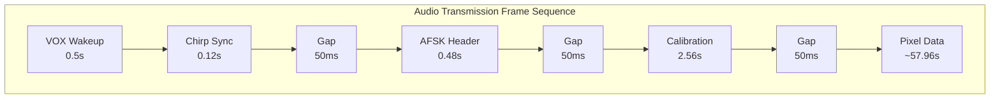
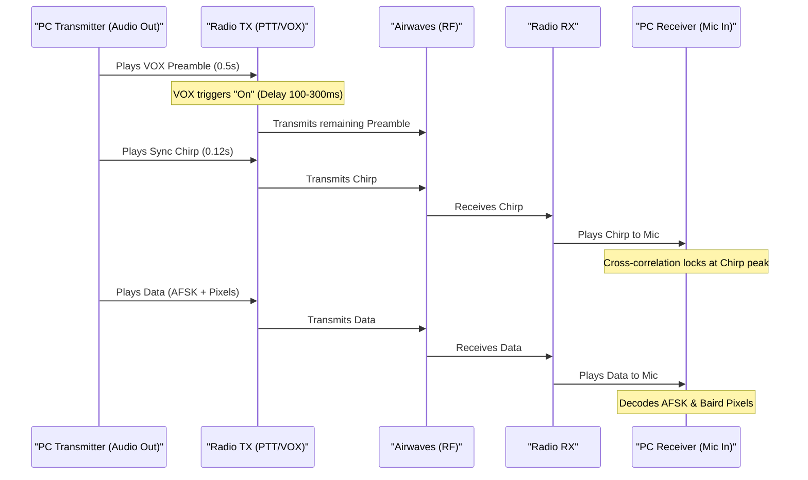

# 📻 The PicTalkie Sound Code Guide!

Sending an image through a walkie-talkie is like **singing a painting into someone's ear**. 

Because radios can be noisy and cut out, PicTalkie wraps the image in a special "audio sandwich" so the computer on the other side can understand exactly what it's hearing. Here is the secret recipe of that sound wave!

---

## 🚗 1. The "Wake Up" Preamble
*   **Analogy**: **Clearing your throat before you speak.**
*   **What sounds like**: A steady, continuous hum (`1500 Hz`) for half a second.
*   **Why we do it**: Many walkie-talkies sleep to save battery. When they hear sound, they take about 1/3 of a second to "wake up" and open the sound gate. This steady tone lets the radio wake up safely **before** the important main message starts!

---

## 🔊 2. The Sync Chirp
*   **Analogy**: **A loud starter-pistol firing at a race track.**
*   **What sounds like**: A fast up-sweep whistle (starts low, ends high like *WHEEEEEEP!*).
*   **Why do we use it**: The receiver computer listens to the audio stream constantly. When it hears that exact frequency sweep, it knows: **"A photo starts EXACTLY HERE."** This lets it synchronize up to the microsecond without missing a beat.

---

## 🎵 3. The Digital Secret Header
*   **Analogy**: **Sending a message by whistling high and low notes.**
*   **What sounds like**: Fast high-pitched birds chirps.
*   **How it works**: Modern computers talk in Binary (1s and 0s). 
    *   If the computer whistles a **High note** (2200 Hz), that means **"1"**.
    *   If it whistles a **Low note** (1200 Hz), that means **"0"**.
*   **Why do we use it**: We use this digital Morse code to shout: *"Hey! This image is 256 pixels wide, 256 pixels tall, and has 3 color layers (Red, Green, Blue)."* Now the receiver knows how big to draw the picture frame!

---

## 📊 4. Analog Calibration
*   **Analogy**: **Testing the volume knob.**
*   **What sounds like**: A staircase of tones rising in volume for about 2.5 seconds.
*   **Why do we use it**: Airwaves and radio speakers distort volume. A medium-bright color might become quiet, or a quiet sound might get boost. The computer sends every possible value (0 through 255) in order. The receiver measures what they *sound like after going through the air*, and builds a correction key that perfectly translates noisy waves back into exact colors.

---

## 🖼️ 5. The Pixel Data (The Analog Painting)
*   **Analogy**: **Drawing with a light dimmer switch.**
*   **What sounds like**: A highly static, textured buzz saw that changes pitch/volume continuously depending on the photo contents.
*   **Why do we use it**: To save air time, we map pixel brightness levels directly to audio variables node values repeated 13x increments to averaging noise cancels cancellation grids out.

---

**Total Song Length**: Under 1 Minute of Airtime!
By packing reliable digital guides at the front, the analog tail can survive almost anything!

---

# 🛠️ Under the Hood: Technical Specifications

For engineers and developers, here is the exact hardware and scheduling breakdown of the Framing Buffer.

## 📊 Frame Schedule Flowchart

## 📡 Radio Propagation Sequence Diagram

This diagram shows how the VOX preamble overcomes radio wake-up delays.

## 📐 Constants Data Table

| Parameter | Relative Duration | Absolute Samples | Technical Spec |
| :--- | :--- | :--- | :--- |
| **Sample Rate** | - | $44,100 \text{ Hz}$ | 16-bit PCM Mono |
| **VOX Wakeup** | $0.5\text{s}$ | $22,050$ | $1,500\text{ Hz}$ Continuous |
| **Sync Chirp** | $0.12\text{s}$ | $5,292$ | $1,000 \rightarrow 3,000\text{ Hz}$ Sweep |
| **Gap Silence** | $0.05\text{s}$ | $2,205$ | $0.0$ Amplitude buffer |
| **AFSK Header** | $0.48\text{s}$ | $21,168$ | Mark: $2200\text{Hz}$ \| Space: $1200\text{Hz}$ (48-bits) |
| **Calibration** | $2.56\text{s}$ | $112,896$ | $256$ Multi-level analog steps |
| **Pixel Data** | $\sim 57.96\text{s}$ | $2,555,904$ | Baird-encoded analog repetition code |
| **Total Duration** | $\mathbf{\sim 61.77\text{s}}$ | $\mathbf{2,723,925}$ | |

